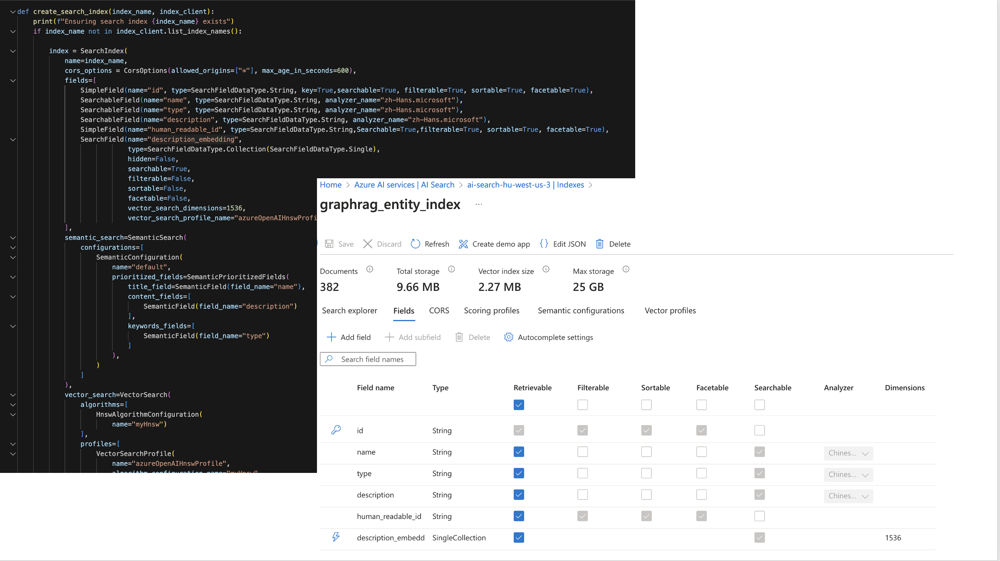
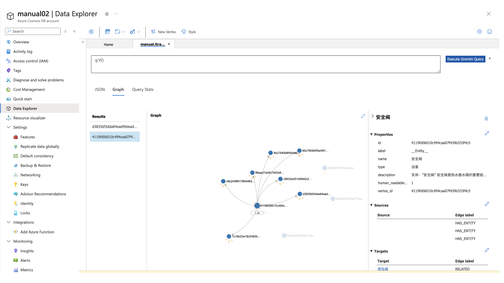
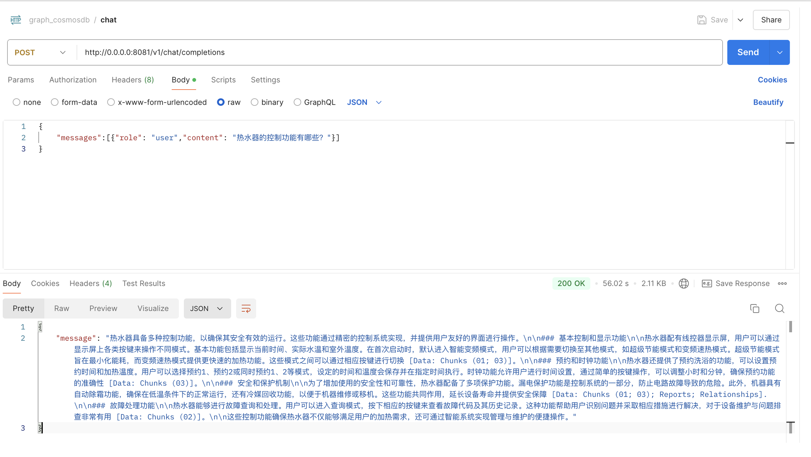

# graphrag-cosmosdb-AI-search-intergration

step1) 

config .env file from .env_template and importParqueFiles/importConfig.py
### import entity to azure AI search

### import all entity and relation to azure cosmosDB gremlin database graph

### search entity from AI search and build context from cosmosdb,then give the LLM response

